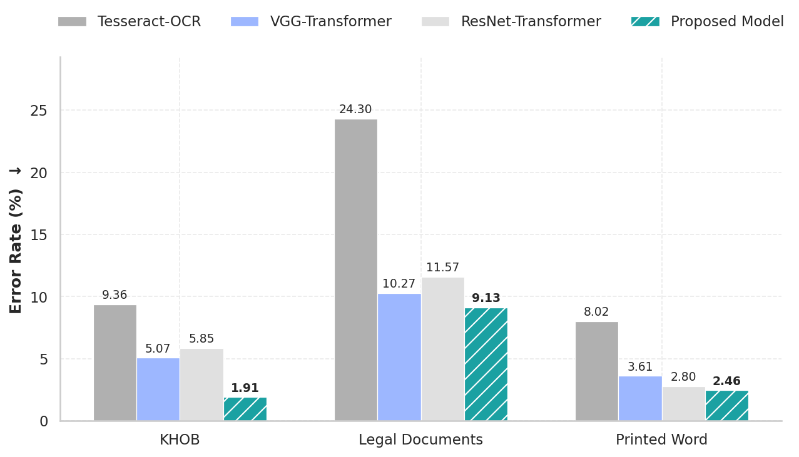

<div align="center">
  
</div>
<hr>

<p align="center">
 <a href="https://github.com/netra-ai-lab/Khmer-OCR-CNN-Transformer"><b>GitHub</b></a> |
  <a href="https://huggingface.co/Darayut/khmer-text-recognition"><b>Model Download</b></a> |
    <a href="https://huggingface.co/collections/Darayut/khmer-text-synthetic"><b>Dataset Download</b></a> |
    <a href="https://huggingface.co/spaces/Darayut/Khmer-Text-Recognition"><b>Inference Space</b></a> |
</p>


<h2>
<p align="center">
  <a href="">A Squeeze-and-Excitation Transformer Network for Khmer Optical Character Recognition</a>
</p>
</h2>

<p align="center">

</p>

<p align="center">
<a href="">Character Error Rate (CER %) on KHOB, Legal Documents, and Printed Word Benchmark</a>       
</p>

## Introduction

This repository contains the implementation, datasets, and evaluation results for the **Squeeze-and-Excitation Transformer Network**, a high-performance Khmer Text Recognition model that utilizes a hybrid architecture combining **Squeeze-and-Excitation** blocks for feature extraction and **BiLSTM** smoothing for context smoothing, specifically designed to handle the complexity and length of Khmer script.

## Overview

Khmer script presents unique challenges for OCR due to its large character set, complex sub-consonant stacking, and variable text line lengths. This project proposes an enhanced pipeline that:
1.  **Chunks** long text lines into manageable overlapping segments.
2.  **Extracts Features** using a **Squeeze-and-Excitation Network** (SE-VGG) that preserves horizontal spatial information.
3.  **Encodes** local spatial features using a Transformer Encoder.
4.  **Merges** the encoded chunks into a unified sequence.
5.  **Smooths Context** using a **BiLSTM** layer to resolve boundary discontinuities between chunks.
6.  **Decodes** the final sequence using a Transformer Decoder.

## Datasets

The model was trained entirely on synthetic data and evaluated on real-world datasets.
### Training Data (Synthetic)
We generated **200,000 synthetic images** to ensure robustness against font variations and background noise.

| Dataset Type | Count | Generator / Source | Augmentations |
| :--- | :--- | :--- | :--- |
| **Document Text** | 100,000 | Pillow + Khmer Corpus | Erosion, noise, thinning/thickening, perspective distortion. |
| **Scene Text** | 100,000 | SynthTIGER + Stanford BG | Rotation, blur, noise, realistic backgrounds. |

### Evaluation Data (Real-World + Synthetic)
| Dataset | Type | Size | Description |
| :--- | :--- | :--- | :--- |
| **KHOB** | Real | 325 | Standard benchmark, clean backgrounds but compression artifacts. |
| **Legal Documents** | Real | 227 | High variation in degradation, illumination, and distortion. |
| **Printed Words** | Synthetic | 1,000 | Short, isolated words in 10 different fonts. |


---

## Methodology & Architecture

### 1. Preprocessing: Chunking & Merging
To handle variable-length text lines without aggressive resizing, we employ a "Chunk-and-Merge" strategy:
*   **Resize:** Input images are resized to a fixed height of 48 pixels while maintaining aspect ratio.
*   **Chunking:** The image is split into overlapping chunks (Size: 48x100 px, Overlap: 16 px).
*   **Independent Encoding:** Each chunk is processed independently by the Squeeze-and-Excitation Network and Transformer Encoder to allow for parallel batch processing.

### 2. Model Architecture: Squeeze-and-Excitation Transformer Network
Our proposed architecture integrates sequence-aware attention and recurrent smoothing to overcome the limitations of standard chunk-based OCR. The model consists of six key modules:


1.  **Squeeze-and-Excitation Network (SE-VGG):**
    *   A modified VGG backbone with **1D Squeeze-and-Excitation** blocks after convolutional layer **3**, **4**, and **5**.
    *   Unlike standard SE, these blocks use **vertical pooling** to refine feature channels while strictly preserving the horizontal width (sequence information).

        


2.  **Patch Module:**
    *   Projects spatial features into a condensed **384-dimensional** embedding space.
    *   Adds local positional encodings to preserve spatial order within chunks.

3.  **Transformer Encoder:**
    *   Captures contextual relationships among visual tokens within each independent chunk.

4.  **Merging Module:**
    *   Concatenates the encoded features from all chunks into a single unified sequence.
    *   Adds **Global Positional Embeddings** to define the absolute position of tokens across the entire text line.

5.  **BiLSTM Context Smoother:**
    *   A Bidirectional LSTM layer that processes the merged sequence.
    *   **Purpose:** Bridges the "context gap" between independent chunks by smoothing boundary discontinuities, ensuring a seamless flow of information across the text line.

        

6.  **Transformer Decoder:**
    *   Generates the final Khmer character sequence using the globally smoothed context.

---

## Training Configuration

*   **Epochs:** 100
*   **Optimizer:** Adam
*   **Loss Function:** Cross-Entropy Loss
*   **Learning Rate Schedule:** Staged Cyclic
    *   *Epoch 0-15:* Fixed 1e-4 (Rapid convergence)
    *   *Epoch 16-30:* Cyclic 1e-4 to 1e-5 (Stability)
    *   *Epoch 31-100:* Cyclic 1e-5 to 1e-6 (Fine-tuning)
*   **Sampling:** 50,000 images randomly sampled/augmented per epoch.

---

## Quantitative Analysis

We benchmarked our **proposed model** against VGG-Transformer, ResNet-Transformer, and Tesseract-OCR.

**Character Error Rate (CER %)** - *Lower is better*

TABLE 1: Character Error Rate (CER in %) results on the KHOB, Legal Documents, and Printed Word

| Model | KHOB | Legal Documents | Printed Word |
| :--- | :--- | :--- | :--- |
| Tesseract-OCR | 6.24 | 24.30 | 8.02 |
| VGG-Transformer | 2.27 | 10.27 | 3.61 |
| ResNet-Transformer | 2.98 | 11.57 | 2.80 |
| **Proposed Model** | $\textcolor{yellow}{1.87}$ | $\textcolor{yellow}{9.13}$ | $\textcolor{yellow}{2.46}$ |

---

## Qualitative Analysis

TABLE 2: Failure cases on KHOB, Legal Document, and Printed Word dataset


TABLE 3: Example of proposed, and baseline model compared with the ground truth. Errors in the predictions are highlighted in red


**Key Findings:**
*   **The Proposed Model** achieves the highest accuracy on long, continuous text lines (KHOB), demonstrating that the **BiLSTM Context Smoother** effectively resolves the chunk boundary discontinuities that limit standard Transformer baselines.
*   On degraded and complex legal documents, **the proposed model** demonstrates superior robustness, significantly outperforming all baselines. This attributes to the **Squeeze-and-Excitation blocks**, which filter background noise while preserving character-specific features.
*   **The Proposed Model** still retains a slight advantage on short, isolated words even where global context is less critical, outperforming both ResNet and VGG Transformer baseline.


## Setup

### Create virtual environment
```bash
# Windows
python -m venv myenv
.\myenv\Scripts\activate

# Mac/Linux
python3 -m venv myenv
source myenv/bin/activate
```

### Installation
```bash
pip install -v git+https://github.com/netra-ai-lab/Khmer-OCR-CNN-Transformer.git@master
```

---
## Inference Usage
This pipeline performs end-to-end OCR by first detecting text lines using Surya and then recognizing characters using our custom CNN-Transformer model.


## Local-Inference
### 1. Command Line Interface (CLI)
```bash
netra_ocr --image path/to/your/image.jpg
```

You can also adjust detection engine, adjust beam, and enable debugging

```bash
netra_ocr --image document.png --engine surya --padding 10 --beam 1 --batch_size 16 --debug
```

### CLI Arguments

| Argument | Type | Default | Description |
| :--- | :--- | :--- | :--- |
| `--image` | `str` | **Required** | Path to the input image file. |
| `--engine` | `str` | `surya` | Choice of detection engine: `surya` (optimized for textlines) or `custom` (trained layout model). |
| `--output` | `str` | `ocr_result.txt` | Path to save the final recognized text. |
| `--padding` | `int` | `6` | Pixels of white-space padding added around each text line. Higher padding can help recognition accuracy. |
| `--beam` | `int` | `1` | Beam width for recognition. `1` is Greedy Search (fastest). Higher values increase accuracy but decrease speed. |
| `--batch_size` | `int` | `8` | Number of text lines to process in parallel on the GPU/CPU. |
| `--debug` | `flag` | `False` | If set, saves every cropped line image and its corresponding text into a `debug_<filename>_<engine>` folder for verification. |


## Huggingface-Inference
1. Setup
```bash
pip install torch torchvision transformers pillow huggingface_hub

# Setup the inference script
wget https://huggingface.co/Darayut/khmer-text-recognition/resolve/main/configuration_khmerocr.py

wget https://huggingface.co/Darayut/khmer-text-recognition/resolve/main/inference.py

```
2. Run via CLI
```bash
python inference.py --image "path/to/image.png" --method beam --beam_width 3

```

3. Run via Python
```python
from inference import KhmerOCR

# Load Model (Downloads automatically)
ocr = KhmerOCR()

# Predict
text = ocr.predict("test_image.jpg", method="beam", beam_width=3)
print(text)

```

---
## References

1. **An Image is Worth 16x16 Words: Transformers for Image Recognition at Scale**  
   *Alexey Dosovitskiy, Lucas Beyer, Alexander Kolesnikov, et al.*  
   ICLR 2021.  
   [arXiv:2010.11929](https://arxiv.org/abs/2010.11929)

2. **TrOCR: Transformer-based Optical Character Recognition with Pre-trained Models**  
   *Minghao Li, Tengchao Lv, Lei Cui, Yijuan Lu, Dinei Florencio, Cha Zhang, Zhoujun Li, Furu Wei.*  
   AAAI 2023.  
   [arXiv:2109.10282](https://arxiv.org/abs/2109.10282)

3. **Toward a Low-Resource Non-Latin-Complete Baseline: An Exploration of Khmer Optical Character Recognition**  
   *R. Buoy, M. Iwamura, S. Srun and K. Kise.*  
   IEEE Access, vol. 11, pp. 128044-128060, 2023.  
   [DOI: 10.1109/ACCESS.2023.3332361](https://doi.org/10.1109/ACCESS.2023.3332361)

4. **Balraj98.** (2018). *Stanford background dataset* [Data set]. Kaggle. https://www.kaggle.com/datasets/balraj98/stanford-background-dataset

5. **EKYC Solutions.** (n.d.). *Khmer OCR benchmark dataset (KHOB)* [Data set]. GitHub. https://github.com/EKYCSolutions/khmer-ocr-benchmark-dataset

6. **Em, H., Valy, D., Gosselin, B., & Kong, P.** (2024). *Khmer text recognition dataset* [Data set]. Kaggle. https://www.kaggle.com/datasets/emhengly/khmer-text-recognition-dataset

7. **Squeeze-and-Excitation Networks**  
   *Jie Hu, Li Shen, and Gang Sun.*  
   CVPR 2018.  
   [arXiv:1709.01507](https://arxiv.org/abs/1709.01507)

8. **Bidirectional Recurrent Neural Networks**  
   *Mike Schuster and Kuldip K. Paliwal.*  
   IEEE Transactions on Signal Processing, 1997.  
   [DOI: 10.1109/78.650093](https://doi.org/10.1109/78.650093)
